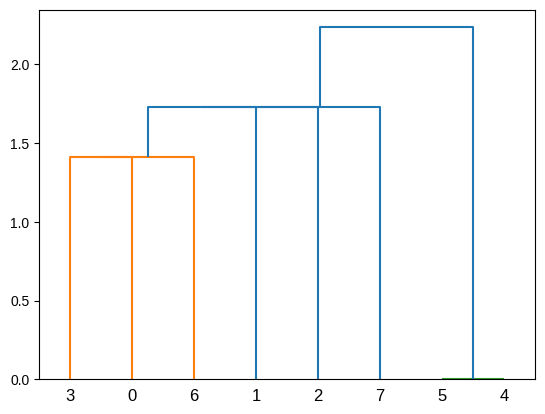
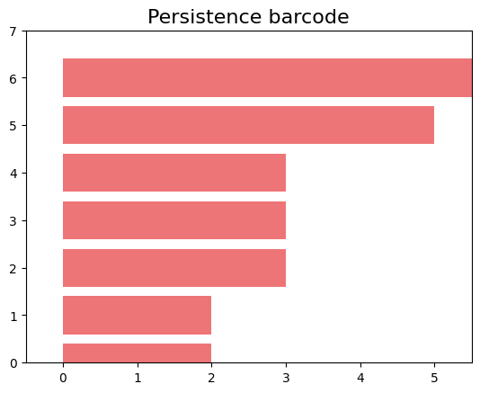
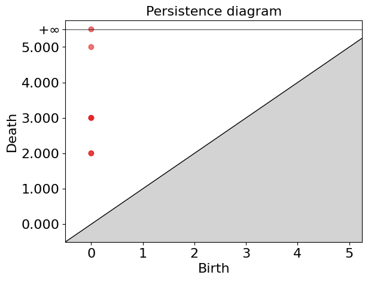
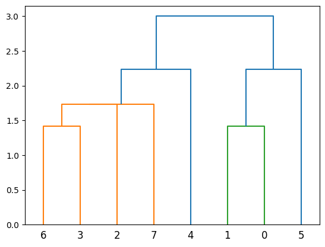
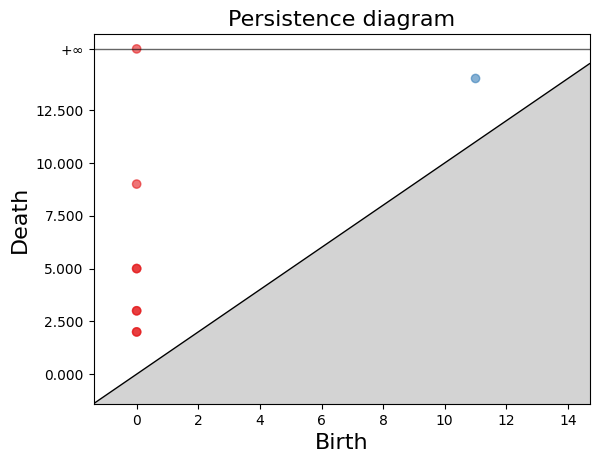
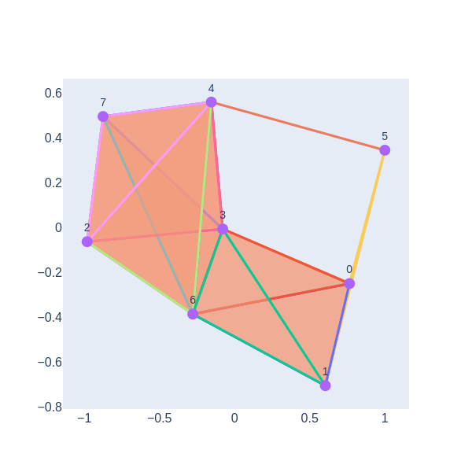
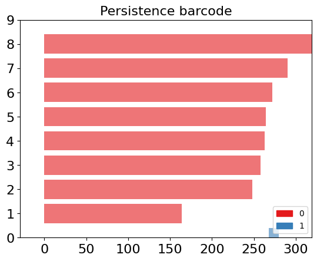
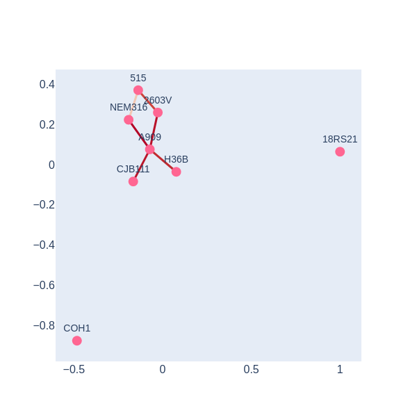

## Introduction to Horizontal Gene Transfer
Horizontal gene transfer (HGT) is a process through which organisms transfer genetic material to each other in a non-traditional way, without sexual reproduction. This phenomenon is particularly common among bacteria. Unlike vertical gene transfer, where genetic material is inherited from parents to offspring, HGT allows bacteria to acquire new genes directly from other organisms, potentially even from different species.

HGT is crucial in the rapid spread of antibiotic-resistant genes among bacteria, enabling them to quickly adapt to new environments and survive in the presence of antibiotics. Antibiotic resistance genes can be located on plasmids, small DNA molecules that can be easily transferred between bacteria, accelerating the spread of resistance. The horizontal transfer of antibiotic-resistance genes poses a significant challenge to global public health. It leads to the development and spread of "superbugs" resistant to multiple antibiotics, complicating the treatment of common infections and increasing mortality.

**Mechanisms of HGT:**
> ## Know more
> If you want to read more on pangenomics go to the book [The Pangenome](https://link.springer.com/book/10.1007/978-3-030-38281-0) edited for Tettelin.
{: .callout}
- **Transformation:** Direct uptake of DNA from the environment.
- **Transduction:** Transfer of genes by bacteriophages (viruses that infect bacteria).
- **Conjugation:** Transfer of genetic material between bacteria through direct contact, usually via a structure known as a pilus.

Topological data analysis (TDA)  allows for identifying complex patterns and structures in large genomic datasets, facilitating the detection 
of HGT can be a powerful tool for detecting the horizontal transfer of antibiotic resistance genes. 
TDA.

This approach educates your audience on an important topic in microbiology and public health and introduces them to advanced data analysis techniques that are transforming research in these areas.

### Applying Topological Data Analysis to HGT Detection

After introducing the concept of horizontal gene transfer (HGT) and its significance, we delve into how topological data analysis (TDA), and more specifically persistent homology, offers a sophisticated approach for detecting HGT within bacterial populations.

**Understanding Persistent Homology in the Context of HGT:**
- In a population experiencing only horizontal gene transfer, persistent homology applied to genomic data reveals a notable pattern: we observe non-empty homology only at $H_0$, indicating the presence of connected components in the barcode diagram. This is expected because HGT tends to link different genomes, thereby increasing connectivity without necessarily creating higher-dimensional holes.

**Case Study 1: Vertical Inheritance Simulation:**
- We simulate a bacterial population's evolution with exclusively vertical gene transfer (inheritance from parent to offspring). Applying persistent homology to this simulation, we expect to see a barcode diagram predominantly showing connected components ($H_0$), with little to no evidence of higher-dimensional features. This serves as a baseline for understanding the impact of vertical inheritance on genomic data topology.

**Case Study 2: Introducing Horizontal Gene Transfer:**
- We then introduce a horizontal gene transfer event within a subgroup of this population and apply TDA to analyze the resulting genomic data. The introduction of HGT is expected to manifest as 1-dimensional holes ($H_1$) in the barcode diagram, distinct from the baseline scenario. These 1-holes indicate the presence of loops or cycles within the data, directly correlating to the HGT events, as they disrupt the simple connectivity pattern seen with vertical inheritance.

**Illustrating HGT with Persistent Homology:**
- To visualize this concept, we'll show an example involving a population of eight *Streptomyces* genomes. Initially, we simulate their evolution with only vertical gene transfer and apply persistent homology, showcasing the barcode diagram that highlights connected components. Next, we simulate HGT events between some of these *Streptomyces* genomes, apply TDA, and observe the emergence of 1-holes in the barcode diagram. This visual and analytical comparison vividly illustrates how HGT introduces complexity into the genomic landscape, detectable through TDA.

By employing TDA and persistent homology, we gain a powerful lens through which to observe and understand the impact of HGT on bacterial genomes. This approach not only underscores the utility of TDA in genomic research but also highlights its potential to uncover intricate patterns of gene transfer that are critical for understanding bacterial evolution and antibiotic resistance.

### **Library**
To begin, we will import the necessary packages.
~~~
import numpy as np
import pandas as pd
import seaborn as sns
import matplotlib.pyplot as plt
from scipy.cluster.hierarchy import dendrogram, linkage
import gudhi as gd
from scipy.spatial.distance import hamming

import plotly.graph_objs as go
import networkx as nx
import plotly.graph_objects as go
import plotly.io as pio
~~~
{: .language-python}
### **Fuctions**
These functions calculate a Hamming distance matrix from an array where the columns are genes and the rows are genomes.
~~~
# Let's assume that "population" is a numpy ndarray with your genomes as rows.
def calculate_hamming_matrix(population):
    # Number of genomes
    num_genomes = population.shape[0]
    # Create an empty matrix for Hamming distances
    hamming_matrix = np.zeros((num_genomes, num_genomes), dtype=int)
   # Calculate the Hamming distance between each pair of genomes
    for i in range(num_genomes):
        for j in range(i+1, num_genomes):  # j=i+1 to avoid calculating the same distance twice
            # The Hamming distance is multiplied by the number of genes to convert it into an absolute distance
            distance = hamming(population[i], population[j]) * len(population[i])
            hamming_matrix[i, j] = distance
            hamming_matrix[j, i] = distance  # The matrix is symmetric
    
    return hamming_matrix
~~~
{: .language-python}

The `create_complex` function generates a 3-dimensional Rips simplicial complex and computes persistent homology from a distance matrix.
~~~
def create_complex(distance_matrix):
    # Create the Rips simplicial complex from the distance matrix
    rips_complex = gd.RipsComplex(distance_matrix=distance_matrix)
    # Create the simplex tree from the Rips complex with a maximum dimension of 3
    simplex_tree = rips_complex.create_simplex_tree(max_dimension=3)
    # Compute the persistence of the simplicial complex
    persistence = simplex_tree.persistence()
    # Return the persistence diagram or barcode
    return persistence, simplex_tree
~~~
{: .language-python}

Function for Visualizing a Cladogram.
~~~
#### Function for visualization
def plot_dendrogram(data):
    """Plot a dendrogram from the data."""
    linked = linkage(data, 'single')
    dendrogram(linked, orientation='top', distance_sort='descending')
    plt.show()
~~~
{: .language-python}

The `visualize_simplicial_complex` function creates a graphical representation of a simplicial complex for a given filtration level, based on a simplex tree.

~~~
def visualize_simplicial_complex(simplex_tree, filtration_value, vertex_names=None, save_filename=None, plot_size=1, dpi=600, pos=None):
    G = nx.Graph()
    triangles = []  # List to store triangles (3-nodes simplices)
    
    for simplex, filt in simplex_tree.get_filtration():
        if filt <= filtration_value:
            if len(simplex) == 2:
                G.add_edge(simplex[0], simplex[1])
            elif len(simplex) == 1:
                G.add_node(simplex[0])
            elif len(simplex) == 3:
                triangles.append(simplex)
    
    # Calculate node positions if not provided
    if pos is None:
        pos = nx.spring_layout(G)
    
    # Node trace
    x_values, y_values = zip(*[pos[node] for node in G.nodes()])
    node_labels = [vertex_names[node] if vertex_names else str(node) for node in G.nodes()]
    node_trace = go.Scatter(x=x_values, y=y_values, mode='markers+text', hoverinfo='text', marker=dict(size=14), text=node_labels, textposition='top center', textfont=dict(size=14))
    
    # Edge traces
    edge_traces = []
    for edge in G.edges():
        x0, y0 = pos[edge[0]]
        x1, y1 = pos[edge[1]]
        edge_trace = go.Scatter(x=[x0, x1, None], y=[y0, y1, None], mode='lines', line=dict(width=3, color='rgba(0,0,0,0.5)'))
        edge_traces.append(edge_trace)
    
    # Triangle traces
    triangle_traces = []
    for triangle in triangles:
        x0, y0 = pos[triangle[0]]
        x1, y1 = pos[triangle[1]]
        x2, y2 = pos[triangle[2]]
        triangle_trace = go.Scatter(x=[x0, x1, x2, x0, None], y=[y0, y1, y2, y0, None], fill='toself', mode='lines+markers', line=dict(width=2), fillcolor='rgba(255,0,0,0.2)')
        triangle_traces.append(triangle_trace)
    
    # Configure the layout of the plot
    layout = go.Layout(showlegend=False, hovermode='closest', xaxis=dict(showgrid=False, zeroline=False, tickfont=dict(size=16, family='Arial, sans-serif')), yaxis=dict(showgrid=False, zeroline=False, tickfont=dict(size=16, family='Arial, sans-serif')))
    
    fig = go.Figure(data=edge_traces + triangle_traces + [node_trace], layout=layout)
    
    # Set the figure size
    fig.update_layout(width=plot_size * dpi, height=plot_size * dpi)
    
    # Save the figure if a filename is provided
    if save_filename:
        pio.write_image(fig, save_filename, width=plot_size * dpi, height=plot_size * dpi, scale=1)
    
    # Show the figure
    fig.show()

    return G
~~~
{: .language-python}
### **Example with a simulated population**
Next, we proceed to load a numpy array, named population_esc, which contains a resistome of a population with 8 genomes, simulated from a genome with three generations, and in each generation, one genome has 2 offspring. The total number of genes is 505, the initial percentage of 1s is 25%, and the gene gain rate in each generation is 1/505.

~~~
population_esc = np.load('/home/jupyter-shaday/GIT/TDA_Horizontal_Genes_Transfer/Notebooks/population_esc.npy')
population_esc
~~~
{: .language-python}
~~~
array([[0, 1, 0, ..., 0, 1, 0],
       [0, 1, 0, ..., 0, 1, 0],
       [0, 1, 0, ..., 0, 1, 0],
       ...,
       [0, 1, 0, ..., 0, 1, 0],
       [0, 1, 0, ..., 0, 1, 0],
       [0, 1, 0, ..., 0, 1, 0]])
~~~
{: .output}
We calculate its distance matrix using the `calculate_hamming_matrix` function with the following command:
~~~
hamming_distance_matrix_esc= calculate_hamming_matrix(population_esc) #calculate hamming matrix
plot_dendrogram(population_esc) ##plot dendrogram
~~~
{: .language-python}

Now, let's observe that this population, which only has vertical inheritance, does not have holes. For this purpose, we use the function we created, `create_complex`, to calculate persistence and the simplex tree.

~~~
# Create a Vietoris-Rips complex from the distance matrix, and compute persistent homology.
persistence_esc, simplex_tree_esc = create_complex(hamming_distance_matrix_esc)
~~~
{: .language-python}

Now, let's visualize the barcode and the persistence diagram.
~~~
gd.plot_persistence_barcode(persistence_esc)
gd.plot_persistence_diagram(persistence_esc)
~~~
{: .language-python}

In these plots, we can observe that we only have non-zero Betti numbers for $\beta_0$, indicating that in this population, which only has vertical inheritance, applying persistent homology does not yield 1-holes.

Now, we want to apply persistent homology to a population that includes horizontal gene transfer. To do this, we first import population_esc_hgt, in which we simulated horizontal transfer among a group of 3 genomes sharing a window of 15 genes.
~~~
population_esc_hgt = np.load('/home/jupyter-shaday/GIT/TDA_Horizontal_Genes_Transfer/Notebooks/population_esc_hgt.npy')
population_esc_hgt
~~~
{: .language-python}
~~~
array([[0, 1, 0, ..., 0, 1, 0],
       [0, 1, 0, ..., 0, 1, 0],
       [0, 1, 0, ..., 0, 1, 0],
       ...,
       [0, 1, 0, ..., 0, 1, 0],
       [0, 1, 0, ..., 0, 1, 0],
       [0, 1, 0, ..., 0, 1, 0]])
~~~
{: .output}

Now the cladogram looks like this:
~~~
plot_dendrogram(population_esc_hgt)
~~~
{: .language-python}

Now let's calculate the Hamming matrix and persistence.

~~~
hamming_matrix_esc_hgt = calculate_hamming_matrix(population_esc_hgt)

persistence_esc_hgt, simplex_tree_esc_hgt = create_complex(hamming_matrix_esc_hgt)
persistence_esc_hgt
~~~
{: .language-python}
~~~
[(1, (11.0, 14.0)),
 (0, (0.0, inf)),
 (0, (0.0, 9.0)),
 (0, (0.0, 5.0)),
 (0, (0.0, 5.0)),
 (0, (0.0, 3.0)),
 (0, (0.0, 3.0)),
 (0, (0.0, 2.0)),
 (0, (0.0, 2.0))]
~~~
{: .output}

We can see that persistence includes a dimension one. Now, let's visually represent the simplicial complex for a filtration time of 11.
~~~
gd.plot_persistence_barcode(persistence_esc_hgt)
gd.plot_persistence_diagram(persistence_esc_hgt)
~~~
{: .language-python}

We have a 1-hole that is born at a distance of 11 and disappears at 14. Now, let's geometrically visualize the simplicial complex for a filtration time of 11.
~~~
visualize_simplicial_complex(simplex_tree_esc_hgt,11)
~~~
{: .language-python}

### **Example with data from Streptococuss**

Importamos los 

~~~
link="/home/jupyter-shaday/Tda_streptococcus/agalactiae_card_full.tsv"
# Load the dataframe with the new link
df_new = pd.read_csv(link, sep='\t')
# Transpose the dataframe such that column names become row indices and row indices become column names
df_transposed_new = df_new.set_index(df_new.columns[0]).T
df_transposed_new
~~~
{: .language-python}
~~~
aro	3000005	3000010	3000013	3000024	3000025	3000026	3000074	3000090	3000118	3000124
agalactiae_18RS21	1	1	1	1	1	1	1	1	1	1
agalactiae_2603V	1	1	1	1	1	1	1	1	1	1
agalactiae_515	1	0	1	1	1	1	1	1	1	1
agalactiae_A909	1	1	1	0	1	1	1	1	1	1
agalactiae_CJB111	1	0	1	0	1	1	1	1	1	1
agalactiae_COH1	1	0	1	1	1	1	1	1	1	1
agalactiae_H36B	1	1	1	1	1	1	1	1	1	1
agalactiae_NEM316	1	0	1	0	1	1	1	1	1	1
8 rows × 1443 columns
~~~
{: .output}

Extraemos los valores del dataframe
~~~
valores=df_transposed_new.iloc[:,:].values
~~~
{: .language-python}
~~~
array([[1, 1, 1, ..., 1, 1, 1],
       [1, 1, 1, ..., 1, 1, 1],
       [1, 0, 1, ..., 1, 1, 1],
       ...,
       [1, 0, 1, ..., 1, 1, 1],
       [1, 1, 1, ..., 1, 1, 1],
       [1, 0, 1, ..., 1, 1, 1]])
~~~
{: .output}
We extract the names of the Strains from the table.

~~~
strains=list(df_transposed_new.index)
strains_names = [s.replace('agalactiae_', '') for s in strains]
strains_names
~~~
{: .language-python}
~~~
['18RS21', '2603V', '515', 'A909', 'CJB111', 'COH1', 'H36B', 'NEM316']
~~~
{: .output}

we apply persistent homology and plot the persistence diagram and barcode, as well as the geometric representation of the simplicial complex for various levels of filtration.
~~~
hamming_matrix_3 = calculate_hamming_matrix(valores)
persistence3, simplex_tree3 = create_complex(hamming_matrix_3)
persistence3
~~~
{: .language-python}
~~~
[(1, (268.0, 280.0)),
 (0, (0.0, inf)),
 (0, (0.0, 290.0)),
 (0, (0.0, 272.0)),
 (0, (0.0, 264.0)),
 (0, (0.0, 263.0)),
 (0, (0.0, 258.0)),
 (0, (0.0, 248.0)),
 (0, (0.0, 164.0))]
~~~
{: .output}

~~~

gd.plot_persistence_barcode(persistence3, legend=True)

~~~
{: .language-python}

~~~

visualize_simplicial_complex(simplex_tree3,270,strains_names)

~~~
{: .language-python}

