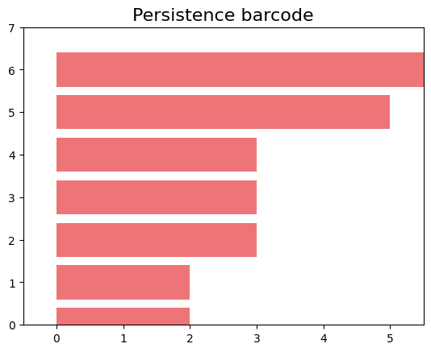
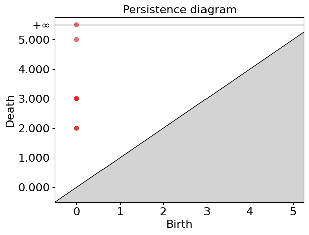
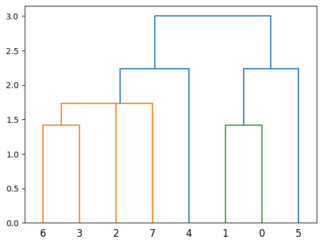
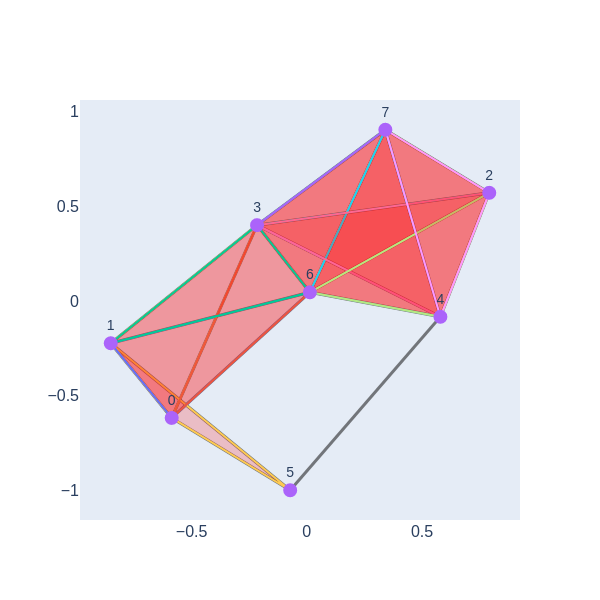

### Introduction to Horizontal Gene Transfer

**Definition and Basic Concepts:**
- Horizontal gene transfer (HGT) is a process through which organisms transfer genetic material to each other in a non-traditional way, that is, without sexual reproduction. This phenomenon is particularly common among bacteria.
- Unlike vertical gene transfer, where genetic material is inherited from parents to offspring, HGT allows bacteria to acquire new genes directly from other organisms, potentially even from different species.

**Mechanisms of HGT:**
- **Transformation:** Direct uptake of DNA from the environment.
- **Transduction:** Transfer of genes by bacteriophages (viruses that infect bacteria).
- **Conjugation:** Transfer of genetic material between bacteria through direct contact, usually via a structure known as a pilus.

**Importance of HGT in Antibiotic Resistance:**
- HGT plays a crucial role in the rapid spread of antibiotic resistance genes among bacteria. This process enables bacteria to quickly adapt to new environments and survive in the presence of antibiotics.
- Antibiotic resistance genes can be located on plasmids, small DNA molecules that can be easily transferred between bacteria, accelerating the spread of resistance.

**Impact on Public Health:**
- The horizontal transfer of antibiotic resistance genes poses a significant challenge to global public health. It leads to the development and spread of "superbugs" that are resistant to multiple antibiotics, complicating the treatment of common infections and increasing mortality.

### Transition to Topological Data Analysis

After laying this groundwork, you can transition to how topological data analysis (TDA) can be a powerful tool for detecting horizontal transfer of antibiotic resistance genes. Mention that TDA allows for the identification of complex patterns and structures in large genomic datasets, facilitating the detection of HGT events that would otherwise be difficult to observe.

This approach not only educates your audience on an important topic in microbiology and public health but also introduces them to advanced data analysis techniques that are transforming research in these areas.

### Applying Topological Data Analysis to HGT Detection

After introducing the concept of horizontal gene transfer (HGT) and its significance, we delve into how topological data analysis (TDA), and more specifically persistent homology, offers a sophisticated approach for detecting HGT within bacterial populations.

**Understanding Persistent Homology in the Context of HGT:**
- In a population experiencing only horizontal gene transfer, persistent homology applied to genomic data reveals a notable pattern: we observe non-empty homology only at \(H_0\), indicating the presence of connected components in the barcode diagram. This is expected because HGT tends to link different genomes, thereby increasing connectivity without necessarily creating higher-dimensional holes.

**Case Study 1: Vertical Inheritance Simulation:**
- We simulate a bacterial population's evolution with exclusively vertical gene transfer (inheritance from parent to offspring). Applying persistent homology to this simulation, we expect to see a barcode diagram predominantly showing connected components (\(H_0\)), with little to no evidence of higher-dimensional features. This serves as a baseline for understanding the impact of vertical inheritance on genomic data topology.

**Case Study 2: Introducing Horizontal Gene Transfer:**
- We then introduce a horizontal gene transfer event within a subgroup of this population and apply TDA to analyze the resulting genomic data. The introduction of HGT is expected to manifest as 1-dimensional holes (\(H_1\)) in the barcode diagram, distinct from the baseline scenario. These 1-holes indicate the presence of loops or cycles within the data, directly correlating to the HGT events, as they disrupt the simple connectivity pattern seen with vertical inheritance.

**Illustrating HGT with Persistent Homology:**
- To visualize this concept, we'll show an example involving a population of eight *Streptomyces* genomes. Initially, we simulate their evolution with only vertical gene transfer and apply persistent homology, showcasing the barcode diagram that highlights connected components. Next, we simulate HGT events between some of these *Streptomyces* genomes, apply TDA, and observe the emergence of 1-holes in the barcode diagram. This visual and analytical comparison vividly illustrates how HGT introduces complexity into the genomic landscape, detectable through TDA.

By employing TDA and persistent homology, we gain a powerful lens through which to observe and understand the impact of HGT on bacterial genomes. This approach not only underscores the utility of TDA in genomic research but also highlights its potential to uncover intricate patterns of gene transfer that are critical for understanding bacterial evolution and antibiotic resistance.

LOS ARBOLES NO TIENEN HOYOS

### **1. Library**
To begin, we will import the necessary packages.
~~~
import numpy as np
import pandas as pd
import seaborn as sns
import matplotlib.pyplot as plt
from scipy.cluster.hierarchy import dendrogram, linkage
import gudhi as gd
from scipy.spatial.distance import hamming

import plotly.graph_objs as go
import networkx as nx
import plotly.graph_objects as go
import plotly.io as pio
~~~
{: .language-python}

These functions calculate a Hamming distance matrix from an array where the columns are genes and the rows are genomes.
~~~
# Let's assume that "population" is a numpy ndarray with your genomes as rows.
def calculate_hamming_matrix(population):
    # Number of genomes
    num_genomes = population.shape[0]
    # Create an empty matrix for Hamming distances
    hamming_matrix = np.zeros((num_genomes, num_genomes), dtype=int)
   # Calculate the Hamming distance between each pair of genomes
    for i in range(num_genomes):
        for j in range(i+1, num_genomes):  # j=i+1 to avoid calculating the same distance twice
            # The Hamming distance is multiplied by the number of genes to convert it into an absolute distance
            distance = hamming(population[i], population[j]) * len(population[i])
            hamming_matrix[i, j] = distance
            hamming_matrix[j, i] = distance  # The matrix is symmetric
    
    return hamming_matrix
~~~
{: .language-python}

The 'create_complex' function generates a 3-dimensional Rips simplicial complex and computes persistent homology from a distance matrix.
~~~
def create_complex(distance_matrix):
    # Create the Rips simplicial complex from the distance matrix
    rips_complex = gd.RipsComplex(distance_matrix=distance_matrix)
    # Create the simplex tree from the Rips complex with a maximum dimension of 3
    simplex_tree = rips_complex.create_simplex_tree(max_dimension=3)
    # Compute the persistence of the simplicial complex
    persistence = simplex_tree.persistence()
    # Return the persistence diagram or barcode
    return persistence, simplex_tree
~~~
{: .language-python}

Funcion para vizualizar un cladograma
~~~
#### Function for visualization
def plot_dendrogram(data):
    """Plot a dendrogram from the data."""
    linked = linkage(data, 'single')
    dendrogram(linked, orientation='top', distance_sort='descending')
    plt.show()
~~~
{: .language-python}

The visualize_simplicial_complex function creates a graphical representation of a simplicial complex for a given filtration level, based on a simplex tree.

~~~
def visualize_simplicial_complex(simplex_tree, filtration_value, vertex_names=None, save_filename=None, plot_size=1, dpi=600, pos=None, seed=None):
    G = nx.Graph()
    triangles = []
    color_map = plt.get_cmap('coolwarm')

    # Fijar la semilla del generador de números aleatorios si se proporciona
    if seed is not None:
        random.seed(seed)
        nx.set_edge_attributes(G, seed, 'seed')

    # Create a dictionary to map simplices to colors based on their filtration values
    simplex_colors = {}
    max_filtration = max(filt for _, filt in simplex_tree.get_filtration() if filt <= filtration_value)

    for simplex, filt in simplex_tree.get_filtration():
        if filt <= filtration_value:
            normalized_value = filt / max_filtration
            color = color_map(normalized_value)
            rgba_color = 'rgba({}, {}, {}, {})'.format(int(color[0]*255), int(color[1]*255), int(color[2]*255), color[3])
            simplex_colors[tuple(simplex)] = rgba_color

            if len(simplex) == 2:
                G.add_edge(simplex[0], simplex[1])
            elif len(simplex) == 1:
                G.add_node(simplex[0])
            elif len(simplex) == 3:
                triangles.append(simplex)

    # Calcular posiciones de los nodos si no se han proporcionado
    if pos is None:
        pos = nx.spring_layout(G, seed=seed)

    # Node trace
    x_values = [pos[key][0] for key in pos]
    y_values = [pos[key][1] for key in pos]
    node_labels = [vertex_names[node] if vertex_names else node for node in pos]
    #node_trace = go.Scatter(x=x_values, y=y_values, mode='markers+text', hoverinfo="text", marker=dict(size=10), text=node_labels, textposition='top center')
    node_trace = go.Scatter(x=x_values, y=y_values, mode='markers+text', hoverinfo="text",marker=dict(size=14), text=node_labels, textposition='top center', textfont=dict(size=14))

    
    # Edge traces
    edge_traces = []
    for edge in G.edges():
        x0, y0 = pos[edge[0]]
        x1, y1 = pos[edge[1]]
        color = simplex_colors.get(edge, 'rgba(0, 0, 0, 0.5)')  # Default color if edge not in simplex_colors
        edge_trace = go.Scatter(x=[x0, x1, None], y=[y0, y1, None], mode='lines', line=dict(width=3, color=color))
        edge_traces.append(edge_trace)

        # Triangle traces
    triangle_traces = []
    for triangle in triangles:
        x0, y0 = pos[triangle[0]]
        x1, y1 = pos[triangle[1]]
        x2, y2 = pos[triangle[2]]
    # Utilizando el nuevo color RGBA para los triángulos
        color = 'rgba(244, 157, 126, 0.545)'  # Color #F49D7E en formato RGBA
        triangle_trace = go.Scatter(x=[x0, x1, x2, x0, None], y=[y0, y1, y2, y0, None], fill='toself', mode='lines', line=dict(width=3), fillcolor=color)
        triangle_traces.append(triangle_trace)

    # Combine all traces and create the figure

    layout = go.Layout(showlegend=False, hovermode='closest', xaxis=dict(showgrid=False, zeroline=False,tickfont=dict(size=16, family='Arial, sans-serif') ), yaxis=dict(showgrid=False, zeroline=False,tickfont=dict(size=16, family='Arial, sans-serif')))

    fig = go.Figure(data=edge_traces + triangle_traces + [node_trace], layout=layout)

    # Set the figure size
    fig.update_layout(width=plot_size * dpi, height=plot_size * dpi)

    # Save the figure if a filename is provided
    if save_filename:
        pio.write_image(fig, save_filename, width=plot_size * dpi, height=plot_size * dpi, scale=1)

    # Show the figure
    fig.show()

    return G
~~~
{: .language-python}

Procedemos a cargar un arreglo numpy, llamado population_esc, el cual contiene un resistoma de una poblacion con 8 genomas, simulada a partir de un genoma  con tres genearciones y en cada generacion un genoma tiene 2 hijos, el numero total de genes es de 505, y el porcentaje inicial de 1 es 25%, y la tasa de ganancia de genes en cada generacion es 1/505.

~~~
population_esc = np.load('/home/jupyter-shaday/GIT/TDA_Horizontal_Genes_Transfer/Notebooks/population_esc.npy')
population_esc
~~~
{: .language-python}
~~~
array([[0, 1, 0, ..., 0, 1, 0],
       [0, 1, 0, ..., 0, 1, 0],
       [0, 1, 0, ..., 0, 1, 0],
       ...,
       [0, 1, 0, ..., 0, 1, 0],
       [0, 1, 0, ..., 0, 1, 0],
       [0, 1, 0, ..., 0, 1, 0]])
~~~
{: .output}
calculamos su matriz de distancia usando la funcion calculate_hamming_matrix, con el siguiente comando
~~~
hamming_distance_matrix_esc= calculate_hamming_matrix(population_esc) #calculate hamming matrix
plot_dendrogram(population_esc) ##plot dendrogram
~~~
{: .language-python}

Ahora veamos que esta poblacion, que solo tiene herencia vertical, no posee hoyos.  Para ello usamos la funcion que creamos create_complex para calcular la persitencia y el simplex tree.

~~~
# Create a Vietoris-Rips complex from the distance matrix, and compute persistent homology.
persistence_esc, simplex_tree_esc = create_complex(hamming_distance_matrix_esc)
~~~
{: .language-python}

Ahora gragicamos el codigo de barras y el diagrama de persistencia
~~~
gd.plot_persistence_barcode(persistence_esc)
gd.plot_persistence_diagram(persistence_esc)
~~~
{: .language-python}

En estas plots pdemos observar que solo tenemos numeros de betti no cero, para $\beta_0$, es decir en esta poblacion que solo hay herencia vertical al aplicar homologia persistente no obtemos 1-hoyos.

Ahora, queremos aplicar la homologia persistente a una poblacion que tenga transferncia horizontal. Para ello primero importamos population_esc_hgt, en la cual simulamos la transferencia horizontal entre un grupo de 3 genomas que se comparten una ventana de 15 genes.
~~~
population_esc_hgt = np.load('/home/jupyter-shaday/GIT/TDA_Horizontal_Genes_Transfer/Notebooks/population_esc_hgt.npy')
population_esc_hgt
~~~
{: .language-python}
~~~
array([[0, 1, 0, ..., 0, 1, 0],
       [0, 1, 0, ..., 0, 1, 0],
       [0, 1, 0, ..., 0, 1, 0],
       ...,
       [0, 1, 0, ..., 0, 1, 0],
       [0, 1, 0, ..., 0, 1, 0],
       [0, 1, 0, ..., 0, 1, 0]])
~~~
{: .output}

ahora el cladograma queda de la siguiente forma
~~~
plot_dendrogram(population_esc_hgt)
~~~
{: .language-python}

Ahora calculamos la matrix de hamming y la persistencia

~~~
hamming_matrix_esc_hgt = calculate_hamming_matrix(population_esc_hgt)

persistence_esc_hgt, simplex_tree_esc_hgt = create_complex(hamming_matrix_esc_hgt)
persistence_esc_hgt
~~~
{: .language-python}
~~~
[(1, (11.0, 14.0)),
 (0, (0.0, inf)),
 (0, (0.0, 9.0)),
 (0, (0.0, 5.0)),
 (0, (0.0, 5.0)),
 (0, (0.0, 3.0)),
 (0, (0.0, 3.0)),
 (0, (0.0, 2.0)),
 (0, (0.0, 2.0))]
~~~
{: .output}

Podemos ver que en la persistencia aparece uno de dimension uno. Veamos ahora la representacion grafica.
~~~
gd.plot_persistence_barcode(persistence_esc_hgt)
gd.plot_persistence_diagram(persistence_esc_hgt)
~~~
{: .language-python}

Tenemos 1-hoyo que nace para distancia 11 y desaparece 14. Ahora vizualicemos geometricamente el complejo simplicial para tiempo de filtracion 11
~~~
visualize_simplicial_complex(simplex_tree_esc_hgt,11)
~~~
{: .language-python}

### Example with data from Streptococuss

Importamos los 

~~~
link="/home/jupyter-shaday/Tda_streptococcus/agalactiae_card_full.tsv"
# Load the dataframe with the new link
df_new = pd.read_csv(link, sep='\t')
# Transpose the dataframe such that column names become row indices and row indices become column names
df_transposed_new = df_new.set_index(df_new.columns[0]).T
df_transposed_new
~~~
{: .language-python}
~~~
aro	3000005	3000010	3000013	3000024	3000025	3000026	3000074	3000090	3000118	3000124	...	3007539	3007637	3007644	3007645	3007650	3007662	3007669	3007671	3007678	3007682
agalactiae_18RS21	1	1	1	1	1	1	1	1	1	1	...	1	0	1	1	1	1	1	1	1	1
agalactiae_2603V	1	1	1	1	1	1	1	1	1	1	...	1	0	1	1	1	0	1	1	1	1
agalactiae_515	1	0	1	1	1	1	1	1	1	1	...	1	0	1	1	1	0	1	1	1	1
agalactiae_A909	1	1	1	0	1	1	1	1	1	1	...	1	0	1	1	1	0	1	1	1	1
agalactiae_CJB111	1	0	1	0	1	1	1	1	1	1	...	1	1	1	1	1	1	1	1	1	1
agalactiae_COH1	1	0	1	1	1	1	1	1	1	1	...	1	0	1	1	1	0	1	1	1	1
agalactiae_H36B	1	1	1	1	1	1	1	1	1	1	...	1	0	1	1	1	1	1	1	1	1
agalactiae_NEM316	1	0	1	0	1	1	1	1	1	1	...	1	0	1	1	1	0	1	1	1	1
8 rows × 1443 columns
~~~
{: .output}

Extraemos los valores del dataframe
~~~
valores=df_transposed_new.iloc[:,:].values
~~~
{: .language-python}
~~~
array([[1, 1, 1, ..., 1, 1, 1],
       [1, 1, 1, ..., 1, 1, 1],
       [1, 0, 1, ..., 1, 1, 1],
       ...,
       [1, 0, 1, ..., 1, 1, 1],
       [1, 1, 1, ..., 1, 1, 1],
       [1, 0, 1, ..., 1, 1, 1]])
~~~
{: .output}
We extract the names of the Strains from the table.

~~~
strains=list(df_transposed_new.index)
strains_names = [s.replace('agalactiae_', '') for s in strains]
strains_names
~~~
{: .language-python}
~~~
['18RS21', '2603V', '515', 'A909', 'CJB111', 'COH1', 'H36B', 'NEM316']
~~~
{: .output}

we apply persistent homology and plot the persistence diagram and barcode, as well as the geometric representation of the simplicial complex for various levels of filtration.
~~~
hamming_matrix_3 = calculate_hamming_matrix(valores)
persistence3, simplex_tree3 = create_complex(hamming_matrix_3)
persistence3
~~~
{: .language-python}
~~~
[(1, (268.0, 280.0)),
 (0, (0.0, inf)),
 (0, (0.0, 290.0)),
 (0, (0.0, 272.0)),
 (0, (0.0, 264.0)),
 (0, (0.0, 263.0)),
 (0, (0.0, 258.0)),
 (0, (0.0, 248.0)),
 (0, (0.0, 164.0))]
~~~
{: .output}

~~~

gd.plot_persistence_barcode(persistence3, legend=True)

~~~
{: .language-python}

~~~

visualize_simplicial_complex(simplex_tree3,270,strains_names)

~~~
{: .language-python}

### Example 1: From book
~~~
data = {'Genoma1': [0, 0],
        'Genoma2': [1, 0],
        'Genoma3': [0, 1],
        'Genoma4': [1, 1]}
df_1 = pd.DataFrame(data, index=['Gen1', 'Gen2'])
df_1
~~~
{: .language-python}

~~~
Genoma1	Genoma2	Genoma3	Genoma4
Gen1	0	1	0	1
Gen2	0	0	1	1
~~~
{: .output}

The distancia function takes a DataFrame df and an optional parameter metrica (defaulting to 'hamming').

The resulting distance_matrix can be used for further analysis, such as clustering or dimensionality reduction, to explore the relationships and similarities between the variables/columns of the DataFrame. 
~~~
def distancia(df, metrica='hamming'):
    # Compute pairwise distances between columns of the DataFrame
    distances = pdist(df.values.T, metric=metrica)
    
    # Convert the condensed distance matrix to a squareform distance matrix
    distance_matrix = squareform(distances)
    return(distance_matrix)

~~~
{: .language-python}
Calculate 
~~~
matrix_distancia_1=distancia(df_1)
matrix_distancia_1
~~~
{: .language-python}

~~~
array([[0. , 0.5, 0.5, 1. ],
       [0.5, 0. , 1. , 0.5],
       [0.5, 1. , 0. , 0.5],
       [1. , 0.5, 0.5, 0. ]])
~~~
{: .output}

Define the function `complejo` to compute the persistence of a Rips simplicial complex from a distance matrix.
~~~
def complejo(distance_matrix):
    # Create the Rips simplicial complex from the distance matrix
    rips_complex = gd.RipsComplex(distance_matrix)
    # Create the simplex tree from the Rips complex with a maximum dimension of 3
    simplex_tree = rips_complex.create_simplex_tree(max_dimension=3)
    # Compute the persistence of the simplicial complex
    persistence = simplex_tree.persistence()
    # Return the persistence diagram or barcode
    return persistence
~~~
{: .language-python}

we used the previosuly function and calcultate de persitence and plot
~~~
persistence_1=complejo(matrix_dintancia_1)
gd.plot_persistence_barcode(persistence_1)
~~~
{: .language-python}

~~~
gd.plot_persistence_diagram(persistence_libro,legend=True)
~~~
{: .language-python}

